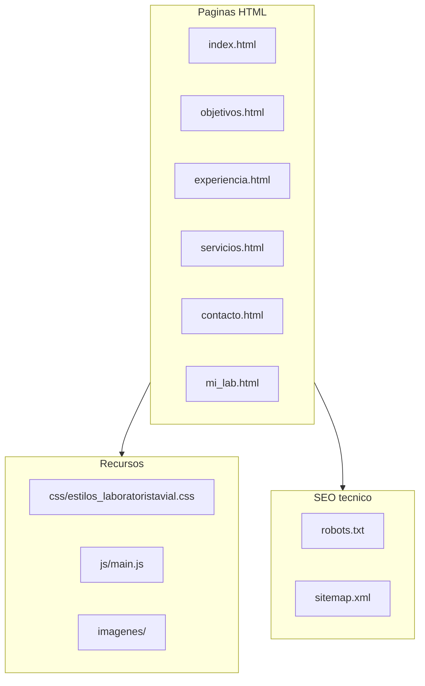
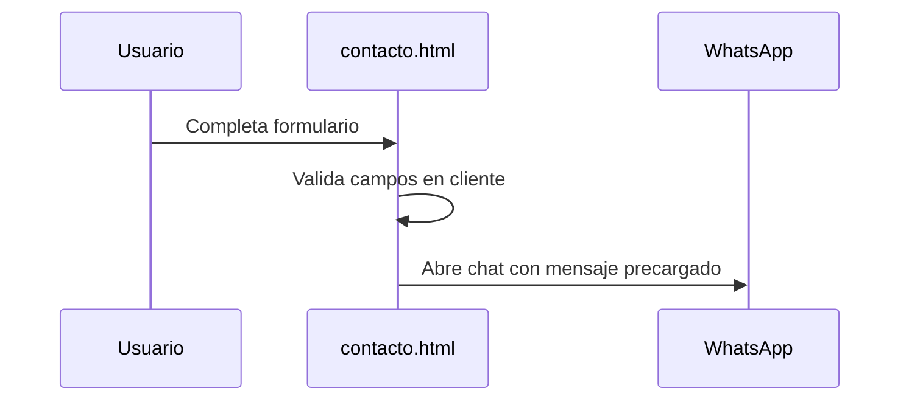

<div align="center">

# Proyecto Laboratorista Vial

**Sitio web corporativo** para presentar servicios de laboratorio y control tecnico de obras viales, con enfoque comercial, visual profesional y optimizacion SEO.

[](https://developer.mozilla.org/docs/Web/HTML)
[](https://developer.mozilla.org/docs/Web/CSS)
[](https://developer.mozilla.org/docs/Web/JavaScript)
[](https://developers.google.com/search)

</div>

---

## Tabla rapida

| Aspecto | Detalle |
|--------|---------|
| **Tipo** | Sitio estatico multi pagina |
| **Stack** | HTML + CSS + JavaScript vanilla |
| **Conversion** | Formulario + WhatsApp |
| **SEO** | Meta por pagina, Open Graph, JSON-LD, `robots.txt`, `sitemap.xml` |

---

## Objetivo del proyecto

Este proyecto busca:

- Comunicar de forma clara los servicios de laboratorio vial.
- Transmitir confianza tecnica y experiencia profesional.
- Mejorar conversiones (contacto y WhatsApp).
- Fortalecer posicionamiento organico en buscadores (SEO on-page y tecnico).

---

## Caracteristicas principales

- Sitio multi pagina en HTML + CSS + JavaScript vanilla.
- Diseno responsive con foco en simetria entre bloques de imagen y texto.
- Navegacion con estado activo automatico por pagina.
- Formulario de contacto integrado a WhatsApp para conversion rapida.
- Metadatos SEO por pagina (title, description, robots, Open Graph).
- Datos estructurados (`JSON-LD`) en portada para `ProfessionalService`.
- Archivos SEO tecnicos: `robots.txt` y `sitemap.xml`.

---

## Estructura del proyecto (vista de arbol)

<details>
<summary><strong>Ver arbol de carpetas y archivos (texto)</strong></summary>

```text
proyecto-laboratoristaVial/
|- index.html
|- objetivos.html
|- experiencia.html
|- servicios.html
|- contacto.html
|- mi_lab.html
|- css/
|  `- estilos_laboratoristavial.css
|- js/
|  `- main.js
|- imagenes/
|- robots.txt
`- sitemap.xml
```

</details>

### Diagrama de alto nivel (Mermaid)




---

<details>
<summary><strong>Descripcion de archivos clave</strong></summary>

- `index.html`: pagina de inicio, propuesta de valor, resumen de servicios y llamados a la accion.
- `servicios.html`: detalle comercial y tecnico de servicios de suelos, asfalto y hormigon.
- `experiencia.html`: respaldo profesional con trayectoria en contratos y obras.
- `objetivos.html`: marco tecnico de trabajo, criterios de control y cumplimiento normativo.
- `contacto.html`: formulario de captacion y CTA directo a WhatsApp.
- `css/estilos_laboratoristavial.css`: sistema visual global (layout, tipografia, componentes, responsive).
- `js/main.js`: logica de interfaz (menu activo + flujo de contacto por WhatsApp).
- `robots.txt`: reglas de rastreo para bots.
- `sitemap.xml`: listado de URLs para facilitar indexacion.

</details>

---

## Conceptos tecnicos empleados

<details>
<summary><strong>1) Frontend estatico</strong></summary>

- HTML semantico por secciones (`header`, `main`, `section`, `footer`).
- CSS moderno con variables (`:root`), `grid`, `media queries` y componentes reutilizables.
- JavaScript vanilla orientado a UX sin dependencia de frameworks.

</details>

<details>
<summary><strong>2) UX/UI y conversion</strong></summary>

- Jerarquia visual clara (titulos, bloques de valor, CTA).
- Tarjetas de servicios uniformes para lectura rapida.
- Botones y textos orientados a accion comercial.
- Contacto simplificado con apertura directa de WhatsApp.

</details>

<details>
<summary><strong>3) SEO on-page y tecnico</strong></summary>

- Titulos y descripciones unicas por pagina.
- Etiquetas Open Graph para mejor comparticion en redes.
- `JSON-LD` para describir el negocio como servicio profesional.
- `robots.txt` y `sitemap.xml` para rastreo e indexacion.
- Segmentacion de paginas internas con `noindex` donde corresponde.

</details>

---

## Requisitos

No requiere compilacion ni dependencias externas.

Solo necesitas:

- Navegador web moderno.
- (Opcional) servidor local para pruebas.

---


## Flujo de contacto actual



El formulario de `contacto.html`:

- valida campos requeridos en cliente,
- construye un mensaje,
- abre WhatsApp con el texto precargado.

Esto prioriza conversion rapida y elimina dependencias de backend en la version actual.

---


## Autor

Eduardo Delgado Pino
